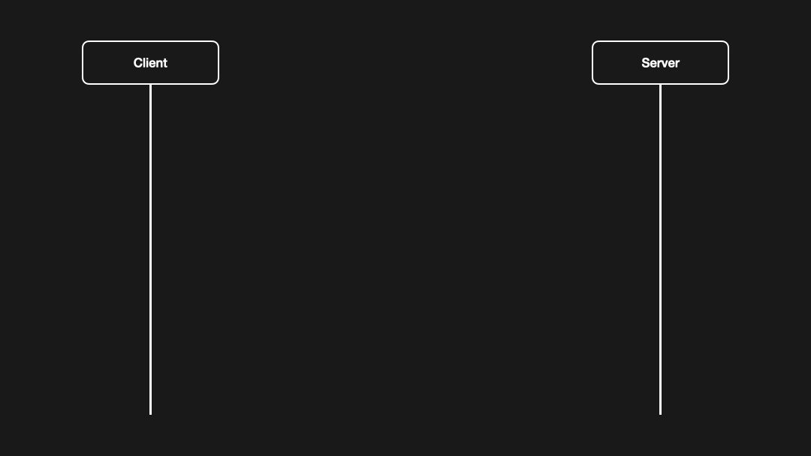

# WebSocket

## What is WebSocket?

WebSocket is a communication protocol that enables full-duplex communication between a client and a server over a single, long-lived connection. It provides a way for web applications to establish a persistent connection and exchange data in real-time.

[Github Repo](https://github.com/behzadam/sample-websocket) (>‿◠)

## How Protocol Switching Works?

Pro-tip: The browser uses TCP to initialize and then switches the protocol to WebSocket after receiving a response from the server, a process known as Protocol Switching.

1. Initiation:

   - The client initiates the process by sending an HTTP GET request to the server.
   - This request includes specific headers indicating the desired protocol upgrade:
     - `Connection: Upgrade`
     - `Upgrade: websocket`
     - `Sec-WebSocket-Key`: A randomly generated key for the handshake
     - Other optional headers for protocol negotiation and extensions

2. Server Response:

   - The server responds with an HTTP 101 Switching Protocols status code, confirming the protocol upgrade.
   - It includes the following headers:
   - `Connection: Upgrade`
   - `Upgrade: websocket`
   - `Sec-WebSocket-Accept`: A calculated response to the client's Sec-WebSocket-Key
     Other optional headers for protocol negotiation and extensions

3. WebSocket Connection Established:

   - Once the handshake is complete, the connection is upgraded to a WebSocket, and data can be exchanged bidirectionally between the client and server.

## Key Points

- Efficiency: Protocol switching avoids the overhead of multiple HTTP requests, making WebSocket ideal for real-time applications.
- Security: WebSocket can be secured using HTTPS (wss://), providing encrypted communication.
- Flexibility: The WebSocket protocol supports various data formats, including text and binary.
- Cross-Platform: WebSocket is supported by most modern web browsers and many other platforms.

## Common Use Cases

WebSocket is widely used in applications that require real-time updates, such as:

- Real-time gaming
- Stock market tickers (trading)
- IoT (Internet of Things) applications

In summary, browser protocol switching in WebSocket connectivity is a fundamental mechanism that enables efficient and real-time communication between clients and servers.

Checkout the [Github Repo](https://github.com/behzadam/sample-websocket) to see a simple client and server implementation.
