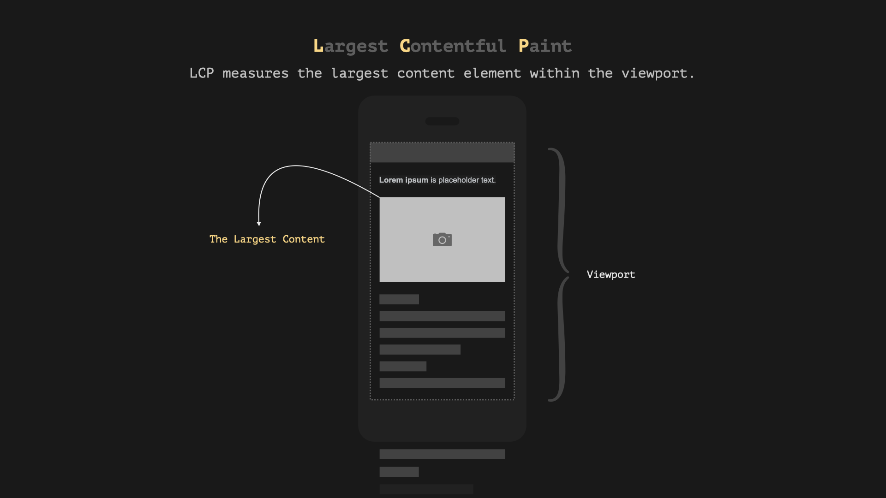
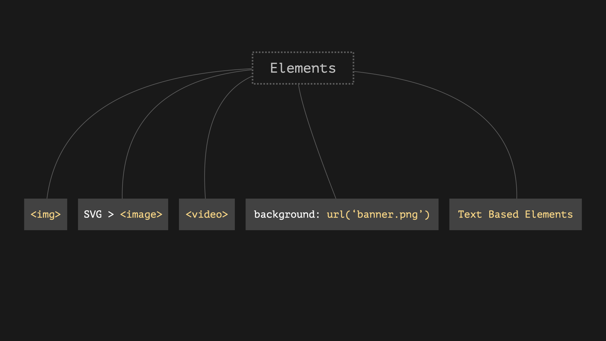
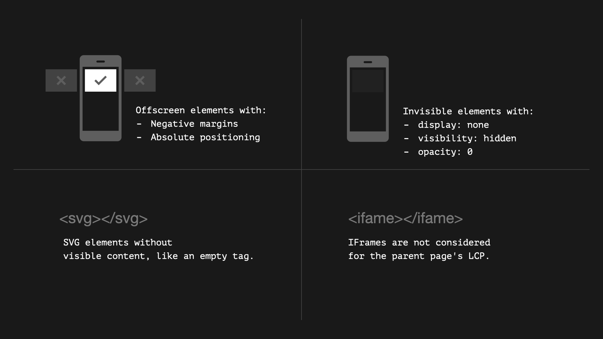

# LCP (Largest Contentful Paint)

LCP measures the time it takes for the largest content element on the page to load.

## Which part of the page is measured?

- Just the viewport is considering and not the full page:

## What elements are considered?

- `` elements
- `<image>` elements within an `<svg>` element
- Poster image for `<video>` elements
- Background images loaded using the url() function
- Text-based elements: Block-level elements containing text nodes or other inline-level text element children (e.g., headings, paragraphs, lists)

## What elements are excluded from LCP?

LCP is for visibility:

- Invisible elements: Elements with display: none or visibility: hidden are not considered.
- Offscreen elements: Elements positioned outside the viewport (e.g., with negative margins or absolute positioning) are not included.
- SVG elements without content: SVG elements without visible content, such as empty `<svg>` tags, are excluded.
- Inline frames: Content within inline frames (IFrames) is not considered for the parent page's LCP.

## Resources

- [A deep dive into optimizing LCP (Recommended video)](https://www.youtube.com/watch?v=fWoI9DXmpdk)
- [Largest Contentful Paint (LCP)](https://web.dev/articles/lcp)
- [What Is the Largest Contentful Paint (LCP)](https://sitechecker.pro/what-is-largest-contentful-paint)
